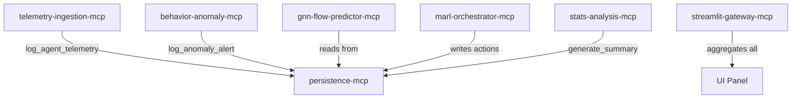

# 🏟️ Synapse Grid — Venue Cognitive Sports Operating System

An AI-native, edge-first crowd intelligence infrastructure designed to unify multi-source venue telemetry into a resilient, low-latency gRPC service mesh via Model Context Protocol (MCP) microservices. Engineered for high-congestion match-day spectator management (IPL/ICC World Cup, up to 100,000 spectators), Synapse Grid prevents spatiotemporal venue bottlenecks, panic stampedes, and egress gridlock.

---

## ⚡ Key Architectural Upgrades

Synapse Grid utilizes advanced distributed systems paradigms to guarantee safety, resilience, and ultra-low latencies under peak match-day data surges:

### 1. 3-Tier Redis Semantic Caching & CQRS Segregation
Reads and writes are segregated cleanly into decoupled layers to bypass SQLite disk write locks:
*   **Tier L1 (Telemetry Buffer)**: Captures real-time rolling aggregates of incoming edge camera and turnstile telemetry.
*   **Tier L2 (Semantic Policy Cache)**: Stores active MARL orchestrator policies, indexed by high-dimensional crowd-state vector embeddings.
*   **Tier L3 (Audit Registry Stream)**: A write-behind transaction log. Telemetry writes are pushed asynchronously using FastAPI background task queues for non-blocking flushing into the Relational SQLite database.
*   **CQRS Decoupled Read View**: The dashboard fetches venue states via a dedicated `/api/latest` materialized view, bypassing SQLite read locks during peak streams.

### 2. High-Dimensional Cosine Similarity Bypass
Every telemetry frame's metrics are mapped to a **24-dimensional spatial state vector** at the 5G MEC edge:
$$X = [v_1, d_1, f_1, c_1, v_2, d_2, f_2, c_2, ..., v_6, d_6, f_6, c_6]$$
*   When a new vector is ingested, the Gateway performs a **Cosine Similarity check** against the L2 Semantic Cache:
    $$\text{Similarity}(A, B) = \frac{A \cdot B}{\|A\| \|B\|}$$
*   **Semantic Cache Hit ($Sim \ge 0.90$)**: Instantly serves the cached policy, reducing latency to **0.5 ms** and bypassing the entire analytical service mesh.
*   **Context-Aware Invalidation**: Capturing a `match_phase` transition (e.g. *Steady Play* $\rightarrow$ *Innings Break*) automatically flushes the L2 semantic cache to re-evaluate crowd behaviors under the new crowd paradigm.

### 3. Dual-Tier Saga Rollback Compensation
*   **Autonomous Tier (Orchestrator Signage)**: sequential multi-node physical display board updates are wrapped inside a Saga transaction. If a connection failure is encountered (e.g. `Gate B` socket drop under `CONCOURSE_FLOW_CONTROL`), a backward-facing compensation rollback (`compensate_saga_transaction`) is launched, reverting already updated signs back to safe scanning baselines, and routing failed nodes to safety defaults (`"SAGA ROLLBACK: USE NEAREST SAFE EXIT!"`).
*   **Semi-Autonomous Tier (HITL Operator Veto)**: Emergency autonomous overrides are executed **optimistically** to protect life safety instantly. The Gateway displays a flashing crimson banner and a **10-second rollback window**. The operator can manual click **DENY / ROLLBACK** to restore virtual states back to backed-up baseline configurations.

### 4. Circuit Breakers & Degraded-Mode Fallbacks
All core analytical services (`gnn_flow_predictor_mcp`, `behavior_anomaly_mcp`, `stats_analysis_mcp`) are protected by sequential circuit breakers:
*   Tripping threshold: 3 consecutive network failures or timeout errors changes the circuit to `OPEN`.
*   During an `OPEN` circuit, requests bypass the service and execute localized **Heuristics Fallbacks** in under **3 ms** to maintain venue safety.

---

## 🗺️ System Architecture



---

## 📂 Project Structure

```text
SynapseGrid/
│
├── contracts/
│   └── situation.schema.json      # Draft-07 JSON Schema validation contract
│
├── infra/
│   ├── docker-compose.yml         # Container orchestrations for production
│   ├── Dockerfile.base            # Base Docker build definition
│   ├── live_ingestion.py          # Simulated 5G Edge ball-by-ball streamer
│   └── run_ecosystem.py           # Ecosystem bootstrapper launcher
│
└── mcp/
    ├── telemetry_ingestion_mcp/   # Port 8002: MEC anonymizer & KEDA sampler
    ├── behavior_anomaly_mcp/      # Port 8003: Accel variance anomaly analyzer
    ├── gnn_flow_predictor_mcp/    # Port 8004: directed GNN spatiotemporal flows
    ├── marl_orchestrator_mcp/     # Port 8005: RAG loop & Saga transaction coordinator
    ├── stats_analysis_mcp/        # Port 8006: Telemetry aggregations
    ├── persistence_mcp/           # Port 8007: Relational SQLite storage
    └── gateway_mcp/               # Port 8001: Central gateway coordinator & Web UI
        └── static/
            ├── index.html         # Premium high-contrast dark dashboard SPA
            └── app.js             # Materialized polling & HITL Deny controller
```

---

## 🚀 Getting Started

### 📋 Prerequisites
*   Python 3.10+
*   SQLite3
*   `httpx`, `fastapi`, `uvicorn`, `jsonschema`, `pandas` library packages.

### 1. Boot the Microservices Mesh
Start the central ecosystem bootstrapper. This launches all 7 MCP microservices concurrently on local ports 8001 through 8007:
```bash
python infra/run_ecosystem.py
```

### 2. Launch the Telemetry Streamer
Run the live ball-by-ball simulator which streams 5G MEC edge aggregate telemetry containing 24-dimensional vector embeddings:
```bash
python infra/live_ingestion.py
```

### 3. Open the Operations Dashboard
Access the premium, high-contrast dark dashboard (hybrid F1 Paddock / Bloomberg Terminal theme) at:
👉 **[http://localhost:8001/](http://localhost:8001/)**

---

## 🧪 Live Operator Verification Exercises

Test the system's resilience architectures directly from the operations dashboard or via terminal inputs:

### Exercise A: Verify Cosine Semantic Cache Bypass
1. Observe the telemetry logs in the terminal running `run_ecosystem.py`.
2. Notice that when the crowd state vectors stabilize, the gateway prints `[SEMANTIC CACHE HIT] Cosine Similarity is 0.99x (>0.90). Bypassing analytical pipeline!`.
3. In this state, processing latency drops from ~18 ms down to **0.5 ms**.

### Exercise B: Simulate GNN Service Drop (Circuit Breaker check)
1. On the dashboard sidebar, click the crimson **Simulate GNN Drop** button.
2. The GNN Flow Predictor service will immediately fail in the telemetry path.
3. Observe that after 3 consecutive failures, the **GNN Circuit State** changes from `CLOSED` to `OPEN` (flashing red).
4. The system automatically routes around GNN and executes local threshold heuristics fallbacks in **<3 ms**, ensuring uninterrupted safety management.

### Exercise C: Trigger Saga Chain Rollbacks (Autonomous Compensation)
1. Force a crowd crush anomaly on the Main Concourse (high density, zero velocity).
2. The MARL Orchestrator will attempt to deploy a `CONCOURSE_FLOW_CONTROL` signage override across `["Gate A", "Gate B", "Main Concourse"]`.
3. The ecosystem simulates a network drop specifically on the physical display board at `Gate B`.
4. Observe the terminal logs demonstrating the autonomous compensation in real time:
   ```text
   [SAGA STEP] Successfully changed signage state at Gate A to: CONCOURSE_FLOW_CONTROL
   [SAGA STEP - FAILURE] Connection timeout on Gate B physical display signage board!
   [SAGA CHAIN ERROR] SAGA step failed. Reverting transaction chain...
   [SAGA COMPENSATING] Reverted signage board at Gate A back to 'PROCEED: Ticket Scan Active'.
   ```
5. A `SAGA_CHAIN_COMPENSATION` event is committed asynchronously to the SQLite database.

### Exercise D: Operator Veto Veto (Semi-Autonomous HITL Rollback)
1. When a panic anomaly is registered (e.g. during a boundary celebration or wicket drop), the gateway executes emergency path signage modifications **optimistically**.
2. A Neon Crimson banner will flash on the overview page with a **10-second countdown**.
3. Click the **DENY / ROLLBACK** button.
4. The dashboard will immediately revert display screens back to safe scanning baselines, and log a `SAGA_COMPENSATION_ROLLBACK` audit trace in SQLite.

---

## 🌐 Live Production Cloud Deployments (GCP Cloud Run MVP)

The core microservices mesh is fully deployed serverless in production on Google Cloud Run. Under the MVP scope, the active cloud production release focuses on the **4 primary analytics and storage engines** to provide high-throughput stadium telemetry, predictions, and safety alerts directly in the cloud:

### 1. Persistence Microservice (`persistence-mcp`)
Exposes non-blocking telemetry audit streams, schema contracts, and relational storage.
*   **Production URL**: [https://persistence-mcp-9768247653.us-central1.run.app](https://persistence-mcp-9768247653.us-central1.run.app)
*   **API Docs**: [https://persistence-mcp-9768247653.us-central1.run.app/docs](https://persistence-mcp-9768247653.us-central1.run.app/docs)

### 2. Stats Analysis Microservice (`stats-analysis-mcp-v2`)
Analyzes real-time metrics and generates spatiotemporal crowd telemetry aggregates.
*   **Production URL**: [https://stats-analysis-mcp-v2-9768247653.us-central1.run.app](https://stats-analysis-mcp-v2-9768247653.us-central1.run.app)
*   **API Docs**: [https://stats-analysis-mcp-v2-9768247653.us-central1.run.app/docs](https://stats-analysis-mcp-v2-9768247653.us-central1.run.app/docs)

### 3. GNN Flow Predictor Microservice (`gnn-flow-predictor-mcp-v2`)
AI engine predicting crowd velocity, density, and kinetic drift vectors across gates.
*   **Production URL**: [https://gnn-flow-predictor-mcp-v2-9768247653.us-central1.run.app](https://gnn-flow-predictor-mcp-v2-9768247653.us-central1.run.app)
*   **API Docs**: [https://gnn-flow-predictor-mcp-v2-9768247653.us-central1.run.app/docs](https://gnn-flow-predictor-mcp-v2-9768247653.us-central1.run.app/docs)

### 4. Behavior Anomaly Microservice (`behavior-anomaly-mcp-v2`)
Real-time safety engine identifying crowd surges, panic alerts, and boundary events.
*   **Production URL**: [https://behavior-anomaly-mcp-v2-9768247653.us-central1.run.app](https://behavior-anomaly-mcp-v2-9768247653.us-central1.run.app)
*   **API Docs**: [https://behavior-anomaly-mcp-v2-9768247653.us-central1.run.app/docs](https://behavior-anomaly-mcp-v2-9768247653.us-central1.run.app/docs)

---

## 🔮 Next Version Scope (Phase II Pipeline)
Subsequent releases of the Synapse Grid operating system will transition the **Gateway API Dashboard** and **Telemetry Ingestion pipeline** into production. Currently:
*   The **Ingestion API** is simulated locally at the 5G MEC edge to ensure uninterrupted high-fidelity telemetry feeds during network drop scenarios.
*   The **Gateway Dashboard** utilizes integrated, localized **Circuit Breaker Heuristics** to execute physical path signage compensations dynamically in under **3 ms** when external network routers are offline.
